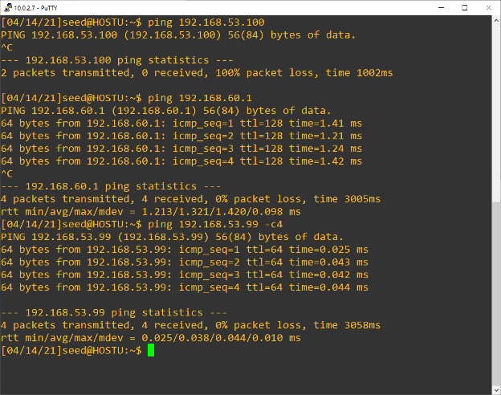
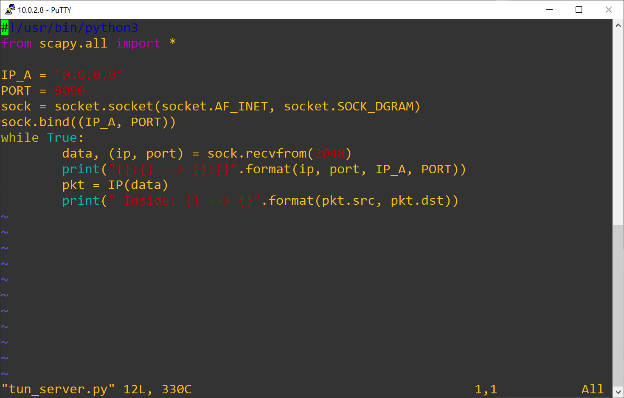
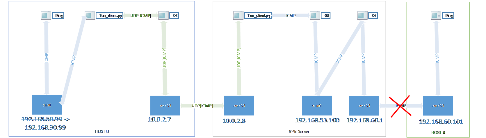

# VPN Tunneling Lab

## Introduction

According to this Lab Manual, the objective of the lab is to implement
the VPN tunnel.

## Topology

The following is the network diagram of the lab

## Background Information

And the following is the ip address table

| HOST       | IP address     | Subnet mask   |
|------------|----------------|---------------|
| HOST U     | 10.0.2.7       | 255.255.255.0 |
| VPN Server | 10.0.2.8       | 255.255.255.0 |
|            | 192.168.60.1   | 255.255.255.0 |
| HOST V     | 192.168.60.101 | 255.255.255.0 |

## Task 1

3 VMs is setup and in the following confguration

| VM Name                           | vVPU assigned | RAM assigned | HDD assigned | Number of vNIC | Vnet assigned        |
|-----------------------------------|---------------|--------------|--------------|----------------|----------------------|
| VPN Server SEEDUbuntu-16.04-32bit | 2             | 4GB          | 20GB         | 2              | 1x NAT, 1x Host only |
| Host U SEEDUbuntu-16.04-32bit     | 2             | 4GB          | 20GB         | 1              | NAT                  |
| Host V SEEDUbuntu-16.04-32bit     | 2             | 2GB          | 20GB         | 1              | Host only            |

### Appliance Network Configuration

HOST U

HOST V

VPN Server NIC1

VPN Server NIC 2

### Connectivity Check: 

- Connectivity between Host V and VPN Server

- Connectivity between VPN Server and Host U  

## Task 2

### Task 2a

- HOSTU

Missing scapy package for python2 Require excute the command  
pip3 install scapy

Screenshot of base code

Screenshot of excution

Excute sudo ./tun.py

Tun0 address

### Task 2b

After excution of the following command

// Assign IP address to the interface

> $ sudo ip addr add 192.168.53.99/24 dev tun0

// Bring up the interface

> $ sudo ip link set dev tun0 up

Screenshot for base modified according from the lab manual

### Task 2c

Screenshot for base modified according from the lab manual

Screenshot for excution screen

IP address

Screenshot of ping to a host at 192.168.60.1, 192.168.53.100,
192,168,53.99

- On Host U, ping a host in the 192.168.53.0/24 network. What are
printed out by the tun.py program? What has happened? Why?

This is because the another end of the tunnel is not setup yet, the
packet found a route for 192.168.53.0/24 via tun0, so the packet pass
top this interface and the application able to get the packet. For
192.168.53.99, the ping command success, because it is the address of
local adapter, so the icmp message goes into loopback interface. The
application has the following printout

- On Host U, ping a host in the internal network 192.168.60.0/24, Does
tun.py print out anything? Why?

Because which command ping excute to ip address 192.168.60.1, the os
lookup the routing table and found the packet should pass via the
physical interface ens33, so the packet did not pass through tun0
interface and the application can not catpure the packet.

### Task 2d

- Screenshot of the code

- Test ping from 192.168.53.99 to 192.168.53.100

- Tun.py output

When arbitrary data placed on the interface, there is no response from
the tun.py and the packet is discarded

## Task 3

Need to install scapy module to VPN Server, run the following command to installl the scapy module

> sudo pip3 install scapy

code screenshot at HOSTU

Code screenshot at VPN Server

- Observation

Screenshoot of running the tun_client.py

Screenshoot of running the tun_client.py

Test with ping to 192.168.53.100

Run the tun server.py program on VPN Server, and then run tun client.py
on Host U

There is output for packet send to the 192.168.53.100. But ping test
fail. The reason behind is that there is only one way traffic from HOST
U to VPN Server the tunnel works in one way and no ip address assigned
as 192.168.53.100 at VPN Server, and you can observe the ping packet is
encalpulated inside udp packet.

The command is

>$ sudo ip route add 192.168.60.0/24 dev tun0 via 192.168.53.99 

Screenshot at VPNServer tun_server.py output

Screen shot of tun_client.py output

## Task 4

Run command and update the sysctl.conf for permanent configuration
> sudo sysctl net.ipv4.ip_forward=1 

VPN Server code listing

Packet capture by the following command

packet captured at HOSTV

## Task 5

Code Listing for HOST U

Code listing for VPN Server

Screenshot for ping and traceroute succes

Packet capture of testing

Screenshot for telnet test success

Packet capture at HOST V of the telnet test

Description

In ping test, the icmp packet at Host U is target to 192.168.60.101, by
the static route setup, the packet will route to interface tun0 and next
hop address is 192.168.59.100. the packet will delivery to tun 0 and
capture by the application tun_client.py. Then tun_client.py encapulate
the icmp packet with a udp packet and deliver to 10.0.2.8 with
destination port 9090. As the application tun_server.py is started and
the udp socket is listensing at port 9090. The UDP packet to
10.0.2.8:9090 will capturedby the tun_server.py and the application will
decapulate the UDP packet and extract its payload to become the IP
packet. After that the application will pass the packet to tun0 right
away. By the IP forward function is enabled at VPNserver’s kernel. The
decapulated packet will forward to 192.168.60.101 according to the
destination address at ip header.

Vice versa, the HOST V server receive the ICMP request and response with
ICMP reply to VPN server. According to the routing table at VPNServer,
the VPN Server receive a icmp reply packet with src ip 192.168.60.101
and destnation 192.168.53.99. the VPN server will forward this packet to
tun0 interface and capture by tun_server.py application. The application
will encapsulate the packet with a UDP packet with destination ip
10.0.2.7 and destination port 9090 Via ens33 interface at VPN server. At
next step, the ens33 interface at Host U will receive the UDP packet and
the application has a udp socket that is listensing at 9090 port. The
application will receive the packet and decapsulate to the icmp reply
packet. Finally, it pass back to tun0 interface and OS will pass to ping
application with success result.

## Task 6 Tunnel-Breaking Experiment

There are 3 possibilites of tunnel breakiing; Firstly, the tunnel breaks
at client side. Secondly, the tunnel breaks at server side. Finally, the
tunnel breaks because the network connectivity to VPNServer lost.

### Case 1, tunnel breaks at HostU side

Procedures for this test

1.  Setup the tunnel by starts tun_client.py at HOST U and tun_server.py
    at VPNServer

2.  At HOST U start telnet connection to HOST V (192.168.60.101).

3.  Test telnet connection by login the session to HOSTV, you will see
    you can type character to the telnet session

4.  Kill tun_client.py, and test will type a few character, observe what
    is happening.

5.  Start the tun_client.py again and observe what is happening

### Case 2, tunnel breaks at VPNServer side

Procedures for this test

1.  Setup the tunnel by starts tun_client.py at HOST U and tun_server.py
    at VPNServer

2.  At HOST U start telnet connection to HOST V (192.168.60.101).

3.  Test telnet connection by login the session to HOSTV, you will see
    you can type character to the telnet session

4.  Kill tun_server.py, and test will type a few character, observe what
    is happening.

5.  Start the tun\_ server.py again and observe what is happening

### Case 3, tunnel breaks because the network connectivity to VPNServer lost

1.  Setup the tunnel by starts tun_client.py at HOST U and tun_server.py
    at VPNServer

2.  At HOST U start telnet connection to HOST V (192.168.60.101).

3.  Test telnet connection by login the session to HOSTV, you will see
    you can type character to the telnet session

4.  Diconeect the host U ens33 connection by config at VM Host, which
    simulate a network cable unplug event, type a few character and
    observe what is happening.

5.  Start the tun\_ server.py again and observe what is happening

### Results of the tests

All 3 tests has the same result, the connection can resume if the
disconnection time is not too long. The charater typed after tunnel
breaks can resume and send to the telent session. And telnet session is
resumed without issue.

From my understanding telnet use TCP as protocol, the packet send
without ack from remote end will resend within certain time windows.
That makes the connection persistent and recoverable even the UDP tunnel
breaks. However, the disconnect time beyond the Retransmission timeout
RTO. In RFC 1122, the recommendation is at least 100 seconds for the
timeout, which corresponds to a value of at least 8, ubuntu default at
15. Another recommendation is at least 3 retransmissions, which is the
default at ubuntu.

## Task 7

## Task 8

Requrie ro remove the default route at HOST U

sudo ip route del 0.0.0.0/0

initial routing table at HOSTU

Initial Routing table at VPN Server

initial routing table at HOSTV

HOST U tun_client.py code listing

The telnet from HostU to HostV is failed; the packet is dropped at the
HOSTV side

VPN Server and HOSTU has traffic the tunnel is operational

Packet capture at ens33 interface at vpnserver

The tun_server.py can decapulate the tunnel packet back into telnet
packet and forward to 192.168.60.0/24 subnet.

Packet capture at tun0 interface at vpnserver

Packet capture at ens34 interface at vpnserver

This is because the ip packet source address is 192.168.30.99, which is
the tun0 ipaddress at HOST U. To solve this issue, simply add the
default route or static route to host V for 192.168.30.0/24 at interface
ens33 via 192.168.60.1, the problem will solve. The following is the
command for the route add.

At host V

sudo ip route del 192.168.30.0/24 dev ens33 via 192.168.60.1

At VPN Server

sudo ip route add 192.168.30.0/24 dev tun0

this is because there is no route for 192.168.30.0/24 in VPNserver and
HOSTV, that means they do not know how to put the packet to correct
device and subnet.

## Task9

Code listing of HOSTU

Ping result and program output

Packet capture

Observation

The ping operation is failed, but the application has an extra output of
other subnet’s packet

After adding more code to the HOST U, the following is the code listing
and output

Tap_client.py output

#  References

Braden, R. (1989, October). *RFC 1122 - Requirements for internet
hosts - Communication layers*. IETF
Tools. <https://tools.ietf.org/html/rfc1122>

Du, W. (2020). *VPN tunneling lab*. SEED
Project. <https://seedsecuritylabs.org/Labs_16.04/Networking/VPN_Tunnel/>
